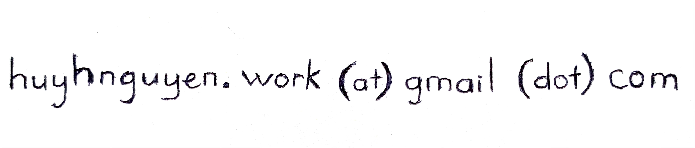

I am **Huy H. Nguyen** (Nguyễn Hồng Huy in Vietnamese).

I am currently a researcher at [**SB Intuitions**](https://www.sbintuitions.co.jp/) (a SoftBank Group company) and a visiting associate professor at the [**National Institute of Informatics (NII)**](https://www.nii.ac.jp/en/), Japan. Previously, I was a project assistant professor (特任助教) at [Echizen Laboratory](https://research.nii.ac.jp/~iechizen/official/index-e.html), NII. 
My research interests include safety, security, and privacy for machine learning, plus fake media generation and detection.

I received my BS. degree (honors program) from [VNUHCM - University of Science](https://en.hcmus.edu.vn/), Vietnam, in 2013, and my Ph.D. degree from [The Graduate University for Advanced Studies, SOKENDAI](https://www.soken.ac.jp/en/) in alliance with the [National Institute of Informatics](https://www.nii.ac.jp/en/), Japan, in 2022.

For more details, please have a look at **my CV [here](https://github.com/honghuy127/honghuy127.github.io/blob/master/files/CV.pdf)** (last update: Oct. 10, 2024).

## Selected News
1. Three deepfake papers were accepted to IJCB 2024.
1. Two papers ([spurious feature generation](https://arxiv.org/abs/2402.08200), [defense against physical adversarial attacks on infrared domain](https://arxiv.org/abs/2309.15519)) were accepted to ICIP 2024.
1. Two papers ([eKYC-Deepfake dataset](https://ieeexplore.ieee.org/document/10444105) and [a comparative study of fine-grained counting methods](https://ieeexplore.ieee.org/document/10440103)) were published in IEEE Access.
1. A paper about [watermarking for LLMs](https://gitlab.com/folbaeni/linguistic-watermark) was accepted to ICASSP 2024.
1. Two NLP papers ([detecting academic AI text](https://arxiv.org/abs/2401.08046) and multimodal out-of-context detection) were accepted to AINA 2024.
1. Our pioneer work on deepfake restoration, namely Cyber Vaccine, was published in [IEEE Access](https://ieeexplore.ieee.org/abstract/document/10238689).
1. Our work on measuring the similarities between other computer vision tasks to deepfake detection was accepted to IJCB 2023 ([arXiv](https://arxiv.org/abs/2310.00922)). 
1. Our collaborative paper on physics-based adversarial attack on near-infrared human detector with [Oscars Lab](https://oscarslab.github.io/aboutus.html) at the University of Tokyo was accepted to ACM Multimedia 2023 ([DOI](https://doi.org/10.1145/3581783.3612082), [implementation](https://github.com/MyNiuuu/AdvNIR)).
1. Our paper on adversarial image purification was accepted to IEEE Open Journal of Signal Processing ([paper](https://ieeexplore.ieee.org/document/10123077), source code will be published soon).
1. Two papers were accepted to WACV 2023. One is about master vein attacks on finger vein recognition systems ([arXiv](http://arxiv.org/abs/2210.10667)); the other is about the theory of the non-robust features on the transferability of adversarial examples ([arXiv](https://arxiv.org/abs/2112.14337)).
1. Our work on applying adversarial machine learning for privacy protection was accepted to [WIFS 2022](https://arxiv.org/abs/2206.14020). Another work on the same topic was previously published in [CVPRW 2021](https://openaccess.thecvf.com/content/CVPR2021W/WMF/papers/Treu_Fashion-Guided_Adversarial_Attack_on_Person_Segmentation_CVPRW_2021_paper.pdf).
1. Our premier work on master faces was published in [IJCB 2020](https://ieeexplore.ieee.org/document/9304893) ([arXiv](https://arxiv.org/abs/2006.08376)) and [IEEE T-BIOM](https://ieeexplore.ieee.org/document/9758063) ([arXiv](https://arxiv.org/abs/2109.03398))
1. Our book chapters on deepfake detection were published in [Handbook of Digital Face Manipulation and Detection - From DeepFakes to Morphing Attacks](https://link.springer.com/book/10.1007/978-3-030-87664-7) ([implementation](https://github.com/nii-yamagishilab/Capsule-Forensics-v2)) and [Frontiers in Fake Media Generation and Detection](https://link.springer.com/book/9789811915239).
1. Our paper on the [OpenForensics dataset](https://zenodo.org/record/5528418#.Ylay4JNBz0o) was published in [ICCV 2021](https://openaccess.thecvf.com/content/ICCV2021/papers/Le_OpenForensics_Large-Scale_Challenging_Dataset_for_Multi-Face_Forgery_Detection_and_Segmentation_ICCV_2021_paper.pdf) ([implementation](https://github.com/ltnghia/openforensics)).
1. Our early work on deepfake detection and segmentation was published in [ICASSP 2019](https://ieeexplore.ieee.org/document/8682602) ([arXiv](https://arxiv.org/abs/1810.11215), [implementation](https://github.com/nii-yamagishilab/Capsule-Forensics)) and [BTAS 2019](https://ieeexplore.ieee.org/document/9185974) ([arXiv](https://arxiv.org/abs/1906.06876), [implementation](https://github.com/nii-yamagishilab/ClassNSeg)).

## Academic Activities
1. **Reviewer**:
  - **Conferences:** NeurIPS, ICLR, ICML, CVPR, ECCV, WACV, ICME, ACL RR, APSIPA ASC.
  - **Journal:** IEEE (Access, TIP, TIFS), IEEE/CAA JAS, ACM TOMM, Elsevier (PRLETTERS, EAAI), EURASIP JIVP, IEICE.
2. **Session Chair**:
  - APSIPA ASC 2020 Special Session: Deep Generative Models for Media Clones and Its Detection.
  - APSIPA ASC 2023 Special Session: Multimedia Security and Privacy in the Age of Deep Learning.

## Contact
Please contact me at

